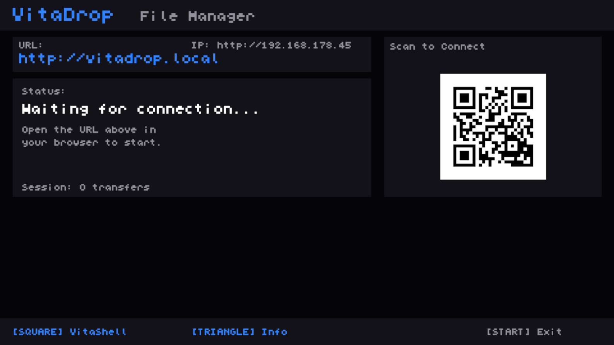
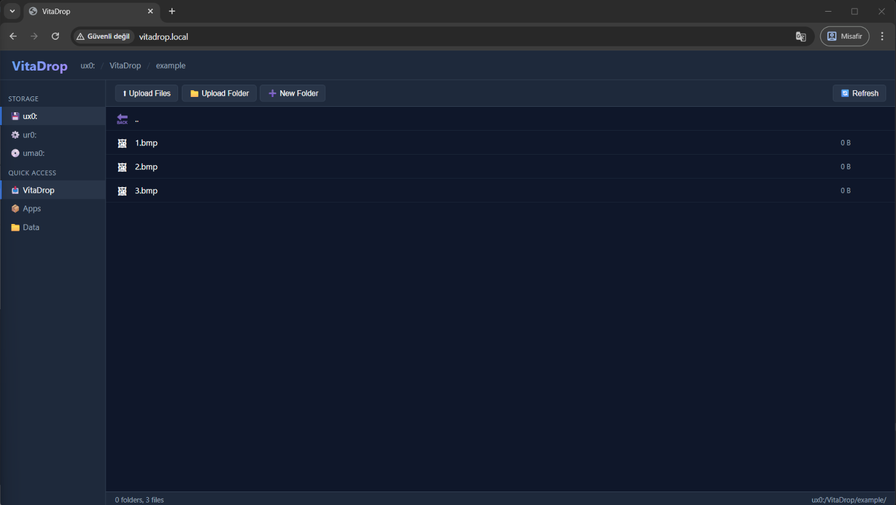

# VitaDrop — ChatGPT Programmed Wi-Fi File Manager for PS Vita

<p align="center">
  
  
</p>

### See it in action:
https://github.com/user-attachments/assets/93b3c8b3-6a51-4f39-b7c1-9f56bccc91c6

VitaDrop transforms your PS Vita into a wireless file server. Browse, upload, download, and manage your entire Vita filesystem from any device with a web browser — no USB cables, no FTP clients, no hassle.

## Features

- **Full File Manager** — Browse your entire Vita filesystem (`ux0:`, `ur0:`, `uma0:`) from a modern web interface
- **Upload Anywhere** — Drag & drop files and entire folders into any directory on your Vita
- **Download Files** — Download any file from your Vita directly to your PC or phone
- **Create & Delete** — Create new folders and delete files/folders right from the browser
- **Real-Time Progress** — Live speed (MB/s), progress percentage, and ETA for all transfers
- **Zero Setup Networking** — Access via `http://vitadrop.local/` (mDNS) — no need to remember IP addresses
- **QR Code Access** — Scan the on-screen QR code with your phone to connect instantly
- **OLED-Safe** — Prevents auto-sleep and screen dimming during operation
- **VitaShell Integration** — Press SQUARE to instantly launch VitaShell
- **Folder Upload** — Full recursive folder upload with automatic directory creation
- **High Performance** — 256KB double-buffered I/O, TCP_NODELAY, zero artificial delays

## Installation

1. Download the latest `vita_drop.vpk` from the build output.
2. Transfer and install it on your Vita via VitaShell or any other VPK installer.

## Usage

1. Ensure your PS Vita and PC/Phone are on the **same Wi-Fi network**.
2. Open **VitaDrop** on the Vita.
3. Navigate to `http://vitadrop.local/` in your browser or scan the QR code.
4. **Browse** — Navigate through folders using the sidebar or breadcrumb navigation.
5. **Upload** — Drag & drop files/folders onto the file list, or use the Upload buttons.
6. **Download** — Click the ⬇ button on any file to download it.
7. **Manage** — Create new folders with ➕ or delete items with ✖.
8. Press **SQUARE** to launch VitaShell, or **START/CIRCLE** to exit.

## Building

```bash
export VITASDK=/usr/local/vitasdk
export PATH=$VITASDK/bin:$PATH
mkdir -p build && cd build
cmake ..
make
```

The output `vita_drop.vpk` will be in the `build/` directory.

## Architecture

| Component | Description |
|---|---|
| `main.c` | Vita OLED UI with QR code, double-buffered framebuffers, input handling |
| `server.c` | HTTP server with REST API (`/api/ls`, `/api/dl`, `/api/upload`, `/api/mkdir`, `/api/delete`), mDNS responder |
| `frontend.h` | Embedded full file manager web UI (HTML/CSS/JS) |
| `server.h` | Shared transfer state and server API declarations |
| `qrcodegen.c/h` | QR code generation library |

## API Endpoints

| Method | Endpoint | Description |
|---|---|---|
| `GET` | `/` | Serve the file manager web UI |
| `GET` | `/api/ls?path=<path>` | List directory contents as JSON |
| `GET` | `/api/dl?path=<path>` | Download a file |
| `POST` | `/api/upload` | Upload file (headers: `X-File-Name`, `X-Upload-Dir`) |
| `POST` | `/api/mkdir?path=<path>` | Create a directory |
| `POST` | `/api/delete?path=<path>` | Delete a file or empty directory |

## Credits

Built with [VitaSDK](https://vitasdk.org/) by Ibrahim Dogan and [ChatGPT](https://chatgpt.com).
