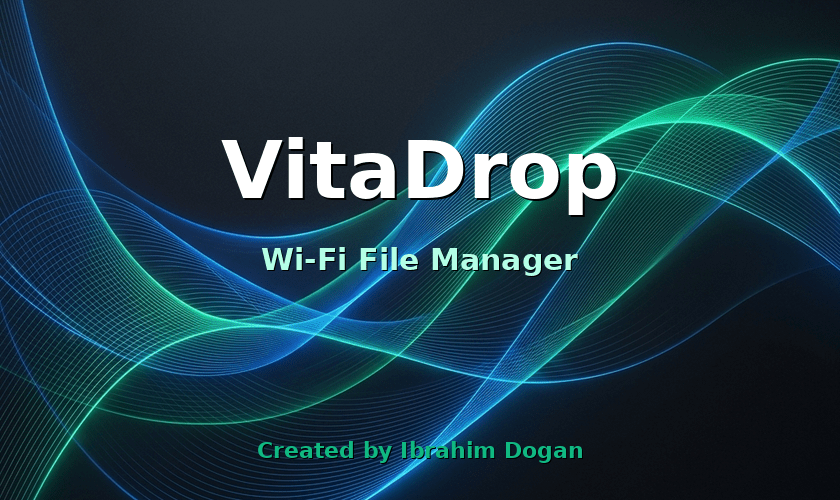

# VitaDrop

A Wi-Fi Direct file transfer utility for the PlayStation Vita, allowing you to easily send files directly from your PC or Smartphone to your Vita natively without needing an FTP client.



## Features

- **Embedded HTTP Server:** A lightweight, bespoke HTTP server built directly into the app using native `SceNet` wrappers.
- **Modern Web Interface:** Connect to your Vita from any browser with a beautifully styled, dynamic HTML/JS frontend featuring a Drag-and-Drop file zone explicitly designed for zero friction.
- **QR Code Scanning:** Quickly link your phone by scanning the QR Code displayed instantly on the Vita's screen!
- **Real-time Transfer Details:** Both the Web Browser and your PlayStation Vita dynamically track real-time statistics including:
  - Total Progress (%)
  - Transfer Rate in MB/s
  - Estimated Time Left (ETA)
- **Zero RAM Limitation:** Designed perfectly for PS Vita's memory constraints. VitaDrop streams file data natively onto the storage disk (`ux0:/VitaDrop/`) without buffering entire downloads in memory.

## Installation

1. Download the latest `vita_drop.vpk` from the **Releases** tab.
2. Transfer it to your PS Vita via VitaShell.
3. Install using VitaShell natively.
4. Launch "VitaDrop" from your home screen.

## How to use

1. Ensure both your PlayStation Vita and your PC or Phone are connected to the exact same Wi-Fi connection.
2. Open *VitaDrop* on the Vita. It will block Wi-Fi sleep automatically and initialize the embedded server.
3. On your browser, navigate to `http://vitadrop.local/` (presented on the Vita's screen) or aim your smartphone's camera at the QR code.
4. **Drag-and-drop** any files/folders into the upload box or use the distinct buttons to recursively select entire folder directories! Your files and their nested sub-folders are streamed flawlessly and directly constructed natively into `ux0:/VitaDrop/`.
5. Press **SQUARE** on the console to cleanly launch VitaShell so you can manually browse to your dropped files!
6. Alternatively, press **START** or **CIRCLE** to cleanly shut down the server when you are done.

## Building

### Requirements
- [VitaSDK](https://vitasdk.org/) installed and configured (`VITASDK` env var set)
- CMake 3.16+

### Build Instructions

```bash
mkdir build && cd build
cmake ..
make
```

The VPK file will be automatically generated at `build/vita_drop.vpk`.

## Credits & Libraries

- [qrcodegen (Nayuki)](https://www.nayuki.io/page/qr-code-generator-library) - Core implementation wrapper utilized for lightning-fast embedded QR Code C generations on the fly!
- Raw standard double-buffered software rendering using Vita's OLED Framebuffer API!

## License

MIT License - Feel free to use and modify!

## Author

**Ibrahim Dogan**
